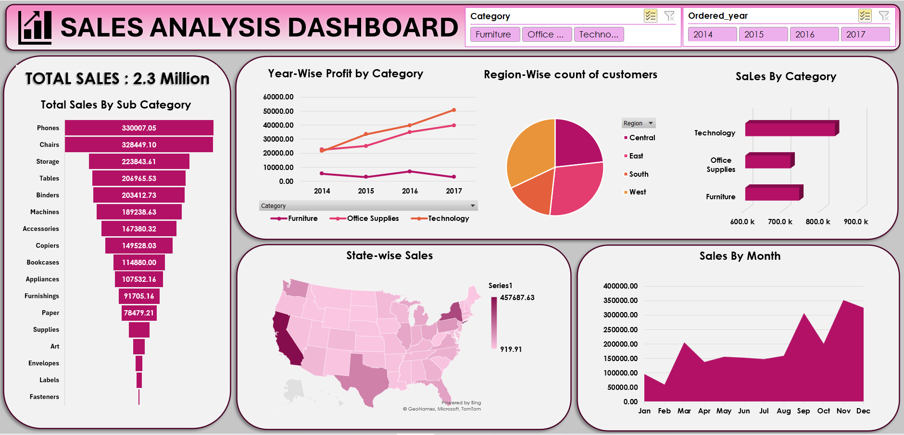

# excel_sample_store_analysis

***1- Project Overview***

This project analyzes the sales and profitability data of "Superstore," a fictional retail giant in the US, over a four-year period (2014–2017). The goal was to identify key revenue drivers, uncovering the root causes of profit loss in specific categories, and provide actionable recommendations to optimize business growth.

***2- Project Aim***

The primary objective of this project is to analyze the historical sales data of the Superstore to identify the drivers of profitability and inefficiency.

***3- Dataset_Used*** :- 

***4- Dataset_Description***

The analysis is based on the "Sample - Superstore" dataset, a robust retail dataset containing transactional data for a fictional US-based superstore from 2014 to 2017.

Total Records:-  Approximately 9,994 rows of unique transactions.

Geographic Scope: United States (covering Central, East, South, and West regions).

Key Attributes: Customer data, product data, location data, financial metrics .

***5-  Business Problem Statement***

The superstore is experiencing high sales volume but inconsistent profitability across different regions and product categories. Despite revenue growth, certain transactions result in significant financial losses (negative profit). The objective is to analyze historical sales data to identify the root causes of these losses—specifically focusing on discounting strategies, shipping costs, and underperforming product lines—and to recommend actionable strategies to maximize net profit without sacrificing customer retention.

***6- Visualisation***

## 📊 Sales Analysis Dashboard

  

***7- Analysis and Findings***

**Revenue vs. Profit Mismatch:** The store generated $2.3 Million in total sales. However, the Furniture category is a major pain point—despite generating high revenue (~$740k), it has yielded near-zero profit for four consecutive years.

**Top Performers:** Technology is the most profitable category, with Phones and Chairs being the highest-selling sub-categories.

**Regional Dominance:** The West and East regions are the primary revenue drivers, with California alone contributing ~20% of total sales ($457k). The South and Central regions significantly underperform.

**Seasonality:** The business is highly seasonal, with sales consistently peaking in November and December, indicating a heavy reliance on Q4 holiday trends.

***8- Conclusion***

The analysis reveals that while Superstore has strong revenue streams, it suffers from operational inefficiencies in the Furniture sector and uncaptured potential in the Central/South regions. Future strategies should focus on adjusting discounting models for furniture and optimizing inventory for the Q4 surge.

***9- Recommendations***

**Audit furniture pricing & logistics:** since furniture sales are high but profits are flat (purple line), high shipping costs or excessive discounting are likely eating the margins.
    Action: review shipping vendors for heavy items (chairs/tables) or reduce discounts on furniture.

**Inventory stockpiling for Q4:** the "sales by month" chart shows a massive spike in Nov/Dec .
    Action: ensure maximum stock of "phones" and "chairs" (top sub-categories) by October to prevent      stockouts during the holiday rush.

**Regional Marketing Strategy:** California alone brings in nearly half a million. 
   Action: Double down on advertising in the West Region to maximize the stronghold, while investigating why the "South" region (smallest slice in Pie Chart) is underperforming.

**Product Bundle Strategy:** "Phones" are the #1 seller and "Technology" is the most profitable category.
Action: Create bundles pairing high-margin Tech items with lower-performing items to boost overall basket profitability.

